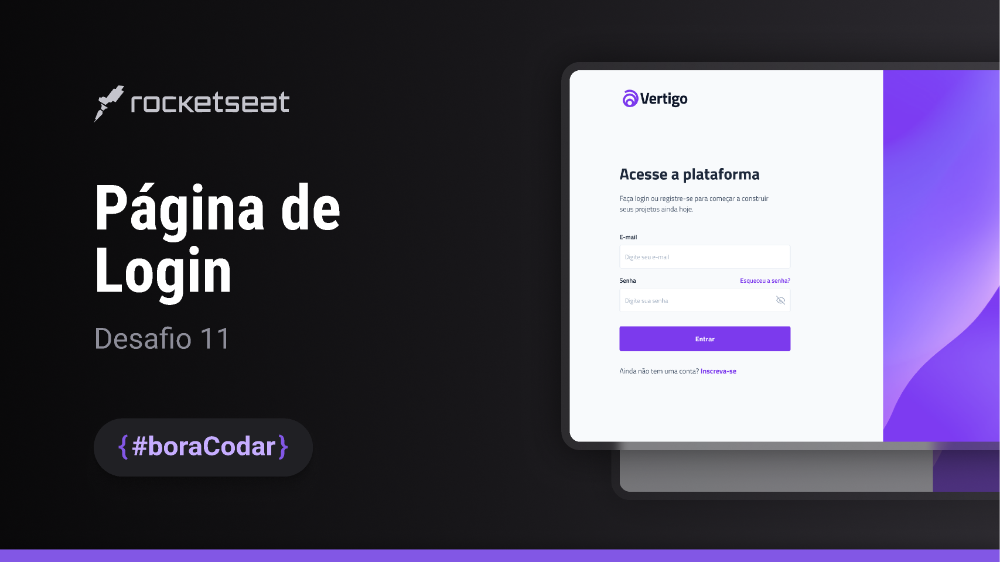

<h1 align="center"> Página de Login </h1>

  <a href="#-tecnologias">Tecnologias</a>&nbsp;&nbsp;&nbsp;|&nbsp;&nbsp;&nbsp;
  <a href="#-projeto">Projeto</a>&nbsp;&nbsp;&nbsp;|&nbsp;&nbsp;&nbsp;
  <a href="#-layout">Layout</a>&nbsp;&nbsp;&nbsp;|&nbsp;&nbsp;&nbsp;
  <a href="#memo-licença">Licença</a>

  

 

  

## 🚀 Tecnologias

Esse projeto foi desenvolvido com as seguintes tecnologias:

- HTML, CSS e JS
- Git e Github
- Figma
- Visual Studio Code

## 💻 Projeto

Este projeto consiste em uma página de login simples e elegante, projetada para oferecer uma experiência de autenticação fácil e intuitiva aos usuários. A página é desenvolvida utilizando tecnologias web modernas, incluindo HTML5, CSS3 e JavaScript para validação de entrada de dados, fornecendo uma interface responsiva e compatível com diversos dispositivos.

## 🔖 Layout

Você pode visualizar o layout do projeto através [DESSE LINK](https://www.figma.com/community/file/1217810469465160264/pagina-de-login-desafio-11?searchSessionId=luobkgto-t7l2sd4a80q). É necessário ter conta no [Figma](https://figma.com) para acessá-lo.

## 📝 Licença

Esse projeto está sob a licença MIT.

---

Feito com ♥ by Hazzard 👋